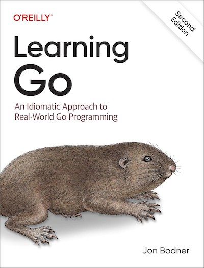

# Exercises In Go(lang) 🏁
Implementing various exercises from the book Learning Go: An Idiomatic Approach to Real-World Go Programming by Jon Bodner
   
## Click [here][Go Link] for the book on Amazon!

[go link]: https://www.amazon.com/Learning-Go-Jon-Bodner-ebook/dp/B0CS5DY1VN?ref_=ast_author_mpb