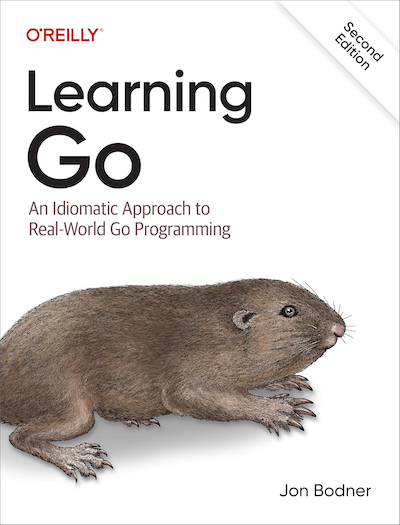

# Exercises in Go (Golang) 🏁

Welcome to the **Exercises in Go** repository! 🚀 Here, you'll find a collection of hands-on coding exercises drawn from the book *Learning Go: An Idiomatic Approach to Real-World Go Programming* by Jon Bodner. This repository serves as a practical guide to practicing and mastering Go by tackling real-world problems and scenarios.

## 🚀 What You'll Learn

- **Idiomatic Go**: Discover best practices and idioms that will help you write clean, efficient, and maintainable Go code.
- **Real-World Applications**: Work through exercises that reflect common tasks and challenges faced by Go developers.
- **Go Fundamentals**: Strengthen your understanding of Go's core concepts, including concurrency, error handling, and interfaces.

   
## Click [here][Go Link] for the book on Amazon!

[go link]: https://www.amazon.com/Learning-Go-Jon-Bodner-ebook/dp/B0CS5DY1VN?ref_=ast_author_mpb
